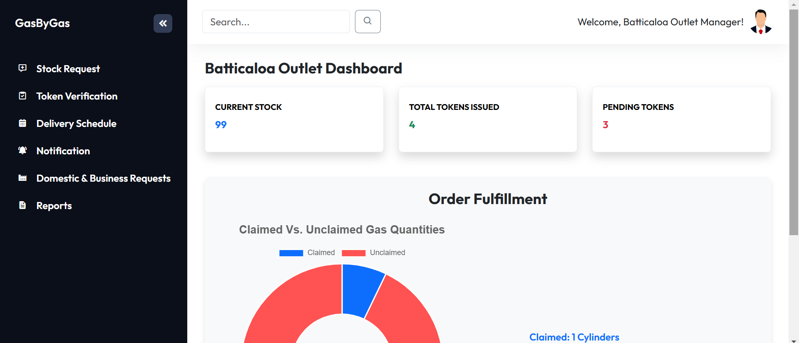

# ⛽ GasByGas Web Application

**GasByGas** is a centralized gas distribution management system designed for both the Head Office and 25+ outlet branches. It streamlines gas cylinder stock management, customer requests, delivery scheduling, and real-time data analytics.

---

## 📸 Screenshots

### 🔐 Login Page

---

### 🏢 Head Office Dashboard

---

### 🧑‍💼 Outlet Manager Dashboard

---

### 📊 Delivery Scheduling Table

---

### 📑 Generated PDF Report

---

## 📌 Modules

### 🏢 Head Office Dashboard
- View total sales, total outlets, and stock alerts
- Monitor gas availability across outlets
- Manage delivery schedules
- View dynamic bar charts using Chart.js
- Analyze reports and export data

### 🧑‍💼 Outlet Manager Dashboard
- View current outlet stock
- Request stock from Head Office
- Issue gas tokens to customers
- View notifications and delivery updates
- Generate customer and outlet reports as PDFs

---

## 💻 Technologies Used

- **Frontend**: HTML, CSS, Bootstrap, JavaScript
- **Backend**: Firebase Firestore
- **Charts**: Chart.js, Doughnut chart
- **PDF**: jsPDF
- **Popups**: SweetAlert2
- **Testing**: Jest

---

## 🚀 Features Summary

- Firebase Firestore for real-time data
- Dynamic charts (bar, doughnut)
- PDF report generation for outlets
- Notifications and low stock alerts
- Secure redirection based on user role
- Customer type logic with monthly limits (Domestic: 4 | Business: 50)

---

## 🧪 Testing

✅ Unit tests via Jest  
✅ Manual test through tst plan and test cases
✅ Screenshots documented for all test cases

---

## 📲 Future Enhancements

- Admin panel for customer account control   
- Mobile app push notifications (FCM)  
- Analytics dashboard with filters

---

## 📄 License

This project is part of academic coursework and is not licensed for commercial use without permission.

---

## 🙋‍♂️ Author

**Nithurshan Nadesan**  
BEng(Hons) in Software Engineering Undergraduate  
[LinkedIn](https://www.linkedin.com/in/nithurshan-nadesan/)

